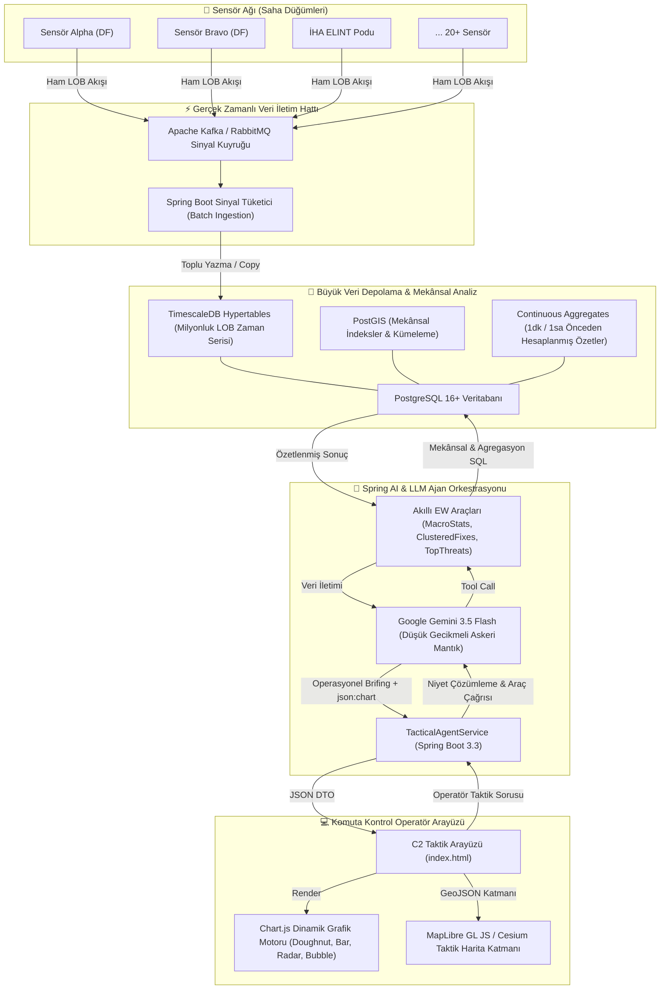

# Yeni Nesil Taktik Elektronik Harp (C2 EW) Büyük Veri ve Yapay Zekâ Mimari Tasarımı
## PostgreSQL, PostGIS, TimescaleDB ve Spring AI ile Milyonlarca Yayın Verisi Yönetimi

---

## 1. MİMARİ VİZYON VE BÜYÜK VERİ ZORLUKLARI

Modern bir harekât sahasında konuşlu elektronik harp (EH) sensör ağları (DF - Direction Finding istasyonları, radar ikaz alıcıları - RWR, İHA podları vb.), saniyede binlerce darbe (pulse) ve yön kestirim hattı (**LOB**) üretir. 

Bu veriler birkaç saat içinde yüzbinlere, birkaç gün içinde ise **milyonlarca satıra** ulaşır.

### Temel Darboğaz: LLM'ler ve Milyonlarca Kayıt
Bir Büyük Dil Modeline (LLM - Google Gemini, Claude, GPT vb.) doğrudan milyonlarca satır veritabanı kaydı **verilemez**. Sebepleri:
1. **Context Window ve Token Sınırı:** Milyonlarca kayıt milyarlarca token demektir; modelin bağlam penceresini anında tüketir.
2. **"Lost in the Middle" Fenomeni:** LLM'e 50.000 satır bile verilse, model listenin ortasındaki kritik atış kontrol radarını gözden kaçırır (dikkat mekanizmasının bozulması).
3. **Maliyet ve Aşırı Gecikme (Latency):** Milyonlarca token'lık bir istemin işlenmesi onlarca saniye sürer ve devasa maliyet yaratır. Gerçek zamanlı bir askeri C2 ortamında 3-5 saniyeden uzun gecikmeler kabul edilemez.
4. **Determinizm İhtiyacı:** Sayım, yoğunluk, kümeleme ve mekânsal kesişim gibi işlemler istatistiksel/üretken bir modele değil, **matematiksel/ilişkisel veritabanı motoruna** yaptırılmalıdır.

### Çözüm Mimarisi: "Akıllı Veri Yoğunlaştırma" (Intelligent Data Reduction)
Yapay zekâ ajanını veritabanının önüne doğrudan ham veri çeken bir boru olarak değil; **veritabanının güçlü agregasyon ve mekânsal indeksleme yeteneklerini yöneten bir komutan** olarak konumlandıracağız:

```
[Milyonlarca Ham Veri: LOB / Pulse / Fix]
                   │
                   ▼
┌────────────────────────────────────────────────────────┐
│  PostgreSQL 16+ / TimescaleDB / PostGIS                │
│  - Hypertables & Zamansal Chunking                     │
│  - Mekânsal İndeksler (GiST R-Tree)                   │
│  - Sürekli Agregasyonlar (Continuous Aggregates)       │
│  - Mekânsal Kümeleme (ST_ClusterDBSCAN)                │
└────────────────────────────────────────────────────────┘
                   │  (Özetlenmiş, Kümeli, İstatistiksel Veri)
                   ▼
┌────────────────────────────────────────────────────────┐
│  Spring Boot 3.3+ / Java 21 İcraat & Araç Katmanı     │
│  - Keyset / Cursor Pagination                          │
│  - Quantized GeoJSON & Vektör Projeksiyonu             │
│  - Parametrik Tehdit Skorlama & Önceliklendirme       │
└────────────────────────────────────────────────────────┘
                   │  (En Kritik 20 Tehdit, Makro Rakamlar, Grafikler)
                   ▼
┌────────────────────────────────────────────────────────┐
│  Spring AI & Google Gemini Copilot Ajanı               │
│  - Askeri Durum Değerlendirmesi                        │
│  - Taktik Karar Desteği                                │
│  - Chart.js & MapLibre Çıktı Sentezi                   │
└────────────────────────────────────────────────────────┘
```

---

## 2. VERİTABANI MOTORU SEÇİMİ: POSTGRESQL + POSTGIS + TIMESCALEDB

İlişkisel güç, mekânsal kabiliyet ve zaman serisi (time-series) performansını tek bir çatı altında birleştiren ideal üçlü:

### 2.1. PostgreSQL 16+ (İlişkisel Çekirdek)
- **ACID Garantisi:** Taktik hedeflerin doğrulanması, kullanıcı yetkilendirmesi, askeri envanter ilişkileri.
- **JSONB Desteği:** Radar üreticilerinin değişken RF parametreleri (staggered PRI, frequency agility, chirp parametreleri) için esnek NoSQL hibrit şema.

### 2.2. PostGIS (Askeri Coğrafi İstihbarat & GIS)
- **WGS-84 (`GEOGRAPHY` / `GEOMETRY(Point, 4326)`):** Küresel eğriliği dikkate alan yüksek hassasiyetli coğrafi hesaplama.
- **`ST_DWithin`:** 10 milyon LOB hattı arasından belirli bir harekât sektörüne düşenleri mikrosaniyeler içinde filtreleme.
- **`ST_ClusterDBSCAN`:** Birbirine yakın yön hatlarının kesişim noktalarını otomatik kümeleyerek **yeni radar kestirim adaylarını (Fix Candidates)** veritabanı içinde otomatik tespit etme.
- **`ST_ConvexHull` / Hata Poligonları:** Kestirim belirsizlik alanlarının mekânsal kesişim sorguları.

### 2.3. TimescaleDB Eklentisi (Milyonluk Zaman Serisi Motoru)
- **Hypertables (Otomatik Bölümlendirme):** `emitter_lobs` tablosu arka planda günlük/saatlik "chunk"lara bölünür. Milyonlarca satır olsa dahi sorgular yalnızca ilgili zaman diliminin chunk'ına gider; B-Tree indeksleri RAM'e sığacak boyutta kalır.
- **Sürekli Agregasyonlar (Continuous Aggregates):** Veritabanı arka planda 1 dakikalık, 5 dakikalık ve 1 saatlik makro istatistikleri (örn. sensör yükü, bant dağılımı, yetim LOB sayıları) hazır hesaplanmış olarak tutar. LLM *"Sahada durum ne?"* dediğinde 5 milyon satırı taramaz; 1 milisaniyede önceden hesaplanmış özeti okur.
- **Veri Sıkıştırma (Native Columnar Compression):** 7 günden eski ham LOB verileri otomatik olarak sütun bazlı (columnar) sıkıştırılarak diskte **%90-95 yer tasarrufu** sağlanır.

---

## 3. VERİTABANI ŞEMA VE İNDEKS TASARIMI (DDL)

```sql
-- Gerekli Eklentilerin Etkinleştirilmesi
CREATE EXTENSION IF NOT EXISTS postgis;
CREATE EXTENSION IF NOT EXISTS timescaledb;
CREATE EXTENSION IF NOT EXISTS pg_trgm; -- Metin ve kimlik hızlı arama için

-- 1. Taktik Kestirimler Tablosu (EmitterFix)
CREATE TABLE emitter_fixes (
    fix_id VARCHAR(32) PRIMARY KEY,
    first_seen TIMESTAMPTZ NOT NULL,
    last_seen TIMESTAMPTZ NOT NULL,
    status VARCHAR(16) NOT NULL, -- ACTIVE, INTERMITTENT, SILENT
    band VARCHAR(8) NOT NULL,     -- X, S, C, Ku, L, UHF, VHF
    frequency_mhz DOUBLE PRECISION NOT NULL,
    radar_type VARCHAR(64) NOT NULL,   -- PANTSIR_S1_TRACKING, PATRIOT_AN_MPQ53, vb.
    platform_type VARCHAR(32) NOT NULL,-- AIRBORNE, GROUND, NAVAL, UNKNOWN
    pri_us DOUBLE PRECISION,
    pulse_width_us DOUBLE PRECISION,
    modulation VARCHAR(32),
    location GEOGRAPHY(Point, 4326) NOT NULL,
    semi_major_axis_meters DOUBLE PRECISION NOT NULL,
    semi_minor_axis_meters DOUBLE PRECISION NOT NULL,
    orientation_degrees DOUBLE PRECISION NOT NULL,
    confidence_percent INT NOT NULL,
    source_lob_count INT NOT NULL,
    threat_level INT DEFAULT 1,  -- 1 (Düşük) - 5 (Kritik Atış Kontrol)
    metadata JSONB               -- Ekstra askeri telemetry ve ELINT etiketleri
);

-- Mekânsal ve Taktik İndeksler
CREATE INDEX idx_fixes_location ON emitter_fixes USING GIST (location);
CREATE INDEX idx_fixes_band_status ON emitter_fixes (band, status);
CREATE INDEX idx_fixes_radar_platform ON emitter_fixes (radar_type, platform_type);
CREATE INDEX idx_fixes_freq ON emitter_fixes (frequency_mhz);
CREATE INDEX idx_fixes_accuracy ON emitter_fixes (semi_major_axis_meters);
CREATE INDEX idx_fixes_last_seen ON emitter_fixes (last_seen DESC);

-- 2. Ham Yön Bulma Hatları Tablosu (EmitterLob - Timescale Hypertable)
CREATE TABLE emitter_lobs (
    lob_id VARCHAR(64) NOT NULL,
    timestamp TIMESTAMPTZ NOT NULL,
    sensor_node_id VARCHAR(32) NOT NULL,
    sensor_location GEOGRAPHY(Point, 4326) NOT NULL,
    bearing_degrees DOUBLE PRECISION NOT NULL,
    angular_accuracy_deg DOUBLE PRECISION NOT NULL,
    frequency_mhz DOUBLE PRECISION NOT NULL,
    band VARCHAR(8) NOT NULL,
    is_associated BOOLEAN NOT NULL DEFAULT FALSE,
    associated_fix_id VARCHAR(32) REFERENCES emitter_fixes(fix_id) ON DELETE SET NULL,
    rf_signature JSONB
);

-- Timescale Hypertable Dönüşümü (Zamansal Otomatik Bölümleme)
SELECT create_hypertable('emitter_lobs', 'timestamp', chunk_time_interval => INTERVAL '1 day');

-- İndeksler
CREATE INDEX idx_lobs_sensor_time ON emitter_lobs (sensor_node_id, timestamp DESC);
CREATE INDEX idx_lobs_band_freq ON emitter_lobs (band, frequency_mhz);
-- KISMİ İNDEKS (Partial Index): Milyonlarca LOB içinde sadece yetim olanları süper hızlı çekmek için!
CREATE INDEX idx_lobs_unassociated ON emitter_lobs (timestamp DESC) WHERE is_associated = FALSE;

-- 3. Sürekli Agregasyon Görünümü (Continuous Aggregate - Anlık Makro Resim)
CREATE MATERIALIZED VIEW mv_tactical_hourly_stats
WITH (timescaledb.continuous) AS
SELECT 
    time_bucket('1 hour', timestamp) AS bucket,
    band,
    sensor_node_id,
    COUNT(*) AS total_lobs,
    COUNT(*) FILTER (WHERE is_associated = FALSE) AS orphan_lobs,
    AVG(frequency_mhz) AS avg_frequency
FROM emitter_lobs
GROUP BY bucket, band, sensor_node_id;
```

---

## 4. LLM VE BÜYÜK VERİ ARASINDAKİ 4 KATMANLI ARAÇ STRATEJİSİ

Milyonlarca satır üzerinde çalışırken Spring AI araçlarının (Tools) nasıl kurgulanması gerektiği:

### Katman 1: Makro Taktik Resim (KPI & Continuous Aggregation)
- **Problem:** Operatör *"Genel durum nedir?"* dediğinde milyonlarca satır taranmamalıdır.
- **Çözüm Metodu:** `getOperationalStatistics()`
- **Arka Plan Çalışması:** `mv_tactical_hourly_stats` görünümünden hazır hesaplanmış veriyi okur. 2 milisaniyede döner:
  - Toplam Fix: 450, Aktif: 280, Yetim LOB: 1.250, Bant Dağılımı: `{X: 120, S: 150...}`.
  - LLM bu makro rakamları anında brifinge ve **Doughnut grafiğine** dönüştürür.

### Katman 2: Mekânsal Kümeleme ve Isı Haritası (Quantization / Clustered GeoJSON)
- **Problem:** Haritada 500.000 adet LOB çizilirse hem tarayıcı donar hem de LLM ne olduğunu anlayamaz.
- **Çözüm Metodu:** `getSpatialHeatmapOrClusters(sectorBbox, minLobsPerCluster)`
- **Arka Plan SQL:** PostGIS `ST_ClusterDBSCAN` fonksiyonu ile noktaları 5 km yarıçaplı kümelere ayırır.
- **LLM Çıktısı:** *"Ankara batısında 4.200 adet X-Band LOB kesişimi ile oluşan yoğun bir batarya kümesi tespit edildi."*

### Katman 3: Akıllı Önceliklendirme ve Tehdit Skorlaması (Top-K Prioritization)
- **Problem:** Operatör *"Aktif radarları listele"* dediğinde sahadaki 1.500 radarın tamamı LLM'e verilemez.
- **Çözüm Metodu:** `queryPriorityEmitters(maxResults, minThreatLevel, region)`
- **Arka Plan Çalışması:** SQL düzeyinde dinamik tehdit skoru hesaplanır:
  $$\text{Tehdit Skoru} = (\text{Bant Önceliği [Ku/X=5, UHF=1]}) \times 0.4 + (\text{Doğruluk [Hata} \le 1000m \rightarrow 5]) \times 0.3 + (\text{Canlılık [Son 5 dk]}) \times 0.3$$
- **Sonuç:** SQL en kritik ilk 20 hedefi döner. LLM operatöre en yüksek risk taşıyan hedefleri ve bunların kıyaslama çubuk grafiğini (`Bar Chart`) sunar.

### Katman 4: Keyset / Cursor Tabanlı Sayfalama (Server-Side Pagination)
- **Problem:** Klasik `OFFSET 100000 LIMIT 50` sorguları derin sayfalarda veritabanını felç eder.
- **Çözüm:** `WHERE (last_seen, fix_id) < (:lastSeenCursor, :lastIdCursor) ORDER BY last_seen DESC, fix_id DESC LIMIT 50`.
- Operatör *"Sonraki 20 hedefi getir"* dedikçe ajan cursor üzerinden anında sıradaki dilimi çeker.

### Katman 5: Spektral Dağılım ve Zaman-Frekans Analitiği (Scatter / Waterfall Analytics)
- **Problem:** Operatör *"Zaman-frekans dağılımını göster"* veya *"Hangi radar hangi frekansta ne zaman aktifti?"* dediğinde binlerce ölçüm noktasının ham koordinatları LLM'e yüklenmemelidir.
- **Çözüm Metodu:** `getTimeFrequencyScatterData(band, radarType, platformType, limit)`
- **Kritik Frontend Çözümü:** Chart.js `scatter` grafiğine metin tabanlı saat (`"19:04"`) verilmesi `NaN` hatası üretir. Mimari olarak zaman **gece yarısından itibaren dakika cinsinden sayısal eksene (`hours * 60 + minutes`)** çevrilir; eksen tick callback'inde tekrar `"HH:mm"` string'ine dönüştürülür. Zamansal boşluklar korunarak gerçekçi bir spektrum şelalesi çizilir.

### Kritik Güvenlik Kalkanı: Savunmacı Parametre Temizleme (LLM Input Sanitization)
- **Problem:** LLM'ler tool argümanı oluştururken parametre belirtilmediğinde sıkça `radarType="*"`, `band="ALL"`, `status="ANY"`, `threatLevel=0` veya `null` string'i üretir. Doğrudan SQL/JPA Specification'a girdiğinde sorgu sıfır sonuç döner.
- **Mimari Çözüm:** `cleanParam(val)` fonksiyonu tüm wildcard/all değerlerini `null`a çevirerek JPA Specification katmanının `cb.conjunction()` (filtresiz / tümü) moduna geçmesini sağlar.

---

## 5. İNTERAKTİF GÖRSELLEŞTİRME VE CHART.JS ENTEGRASYONUNUN GELİŞTİRİLMESİ

Önceki aşamada hayata geçirdiğimiz `json:chart` protokolü, büyük veri mimarisinde arka plandaki Time-Series ve OLAP motorlarıyla beslenecektir:

### 1. Zaman Serisi Frekans Trend Grafiği (`line`)
- **Kullanım:** Son 24 saat içinde belirli bir sektördeki radar aktivitesinin saatlik dalgalanması.
- **Veri Kaynağı:** TimescaleDB `time_bucket('1 hour', timestamp)` agregasyonu.
- **Ajan Rolü:** *"Gece saat 02:00 ile 04:00 arasında X-Band yayınlarında %300 artış tespit edilmiştir (Olası gece hava harekâtı hazırlığı)."*

### 2. 360° Kutupsal Kerteriz Yoğunluğu (`polarArea`)
- **Kullanım:** Belirli bir sensör düğümünün 360 derecelik çevresinde hangi açılardan en yoğun sinyal aldığı.
- **Veri Kaynağı:** `SELECT width_bucket(bearing_degrees, 0, 360, 36) ...` (10 derecelik açısal dilimleme).

### 3. Çok Hedefli RF İmza Kıyaslaması (`radar` / Spider)
- **Kullanım:** Bilinen ELINT radar kütüphanesindeki şablon (library template) ile sahadan yeni kestirilen hedef arasındaki parametrik uyum (Benzerlik Yüzdesi).

---

## 6. SİSTEM MİMARİSİ VE BİLEŞEN AKIŞ DİYAGRAMI (MERMAID)



---

## 7. YENİ PROJEYE BAŞLARKEN İZLENECEK UYGULAMA YOL HARİTASI

1. **Adım 1 - Altyapı Hazırlığı:**
   - Docker Compose ile `postgres:16` imajına `postgis/postgis` ve `timescale/timescaledb-ha` eklentileri kurulu bir test veritabanı ayağa kaldırılması.
2. **Adım 2 - Gerçekçi Büyük Veri Üreteci (Data Generator):**
   - Rastgele 1.000.000 adet LOB ve 50.000 adet Fix üreten yüksek performanslı bir Java simülatörü yazılması (`COPY` komutuyla hızlı yükleme).
3. **Adım 3 - Repository Katmanının Spring Data JPA / JDBC ile Yeniden Yazılması:**
   - Ham entity yüklemek yerine doğrudan DTO projection ve PostGIS fonksiyonlarını (`ST_DWithin`, `ST_ClusterDBSCAN`) çağıran `Native Query` metodları.
4. **Adım 4 - Spring AI Araçlarının Yenilenmesi:**
   - `countEmitterLobs`, `queryPriorityEmitters`, `getMacroAggregates` metodlarının doğrudan SQL Continuous Aggregates yapılarına bağlanması.
5. **Adım 5 - Genişletilmiş Görselleştirme:**
   - Zaman serisi aktivite çizgisi (`line`) ve açısal yoğunluk kutup grafiği (`polarArea`) eklenerek Chart.js yeteneklerinin 7 grafik tipine çıkarılması.

---

## 8. MİMARİ PARADİGMA DÖNÜŞÜMÜ: "GÖZ (VIEWING)" İLE "AKIL (REASONING)" AYRIMI

Taktik Elektronik Harp (EH) ve Komuta Kontrol (C2) sistemlerinde yaşanan en kritik tasarım yanılgısı; **Büyük Dil Modelini (LLM) bir veri listeleme / ızgara (grid) aracı gibi kullanmaya çalışmaktır.**

### 8.1. Temel İlke ve Sorumlulukların Ayrılması (Separation of Concerns)

```
┌─────────────────────────────────────────────────────────────────────────────────────────────┐
│                              OPERATÖR VE DURUMSAL FARKINDALIK                               │
├─────────────────────────────────────────────┬───────────────────────────────────────────────┤
│            "GÖZ" KATMANI                    │                 "AKIL" KATMANI                │
│    (High-Throughput Presentation & UI)      │       (LLM Reasoning & Analytical Copilot)    │
├─────────────────────────────────────────────┼───────────────────────────────────────────────┤
│ • Milyonlarca LOB / Pulse / Fix verisi.     │ • Asla ham satırları tek tek sayıklamaz.      │
│ • Sanallaştırılmış yüksek hızlı tablolar.   │ • Büyük resmi görür, hipotez ve çıkarım yapar.│
│ • Milisaniyelik filtreleme, sıralama, sayfa.│ • "Neden Ku bandında yetim LOB arttı?" çözer. │
│ • Donanım hızlandırmalı harita çizimi.      │ • Düşman karıştırma / aldatma taktiğini sezer.│
│ • Operatörün veri üzerinde doğrudan gezisi. │ • Komutana operasyonel eylem tavsiyesi üretir.│
│ • Teknolojiler: TanStack/AG-Grid, MapLibre. │ • Teknolojiler: Spring AI, Google Gemini.     │
└─────────────────────────────────────────────┴───────────────────────────────────────────────┘
```

### 8.2. Neden LLM Sayfalama ve Ham Listeleme ile Boğulmamalıdır?
1. **Ekonomik ve Hesaplama Maliyeti:** LLM'e her *"bana sonraki sayfayı da ver"* dendiğinde 20 satırlık ham tablonun token olarak üretilmesi; saniyelerce gecikme, yüksek API maliyeti ve gereksiz context şişmesi demektir.
2. **Yapay Zekâ Katma Değerinin Kaybı:** Bir SQL motorunun `SELECT ... OFFSET ...` ile 2 milisaniyede döneceği bir işlemi LLM'e markdown tablosu olarak çizdirmek, yapay zekânın asıl gücü olan karar destek ve taktik akıl yürütme potansiyelini harcar.
3. **Sayfalamanın Doğru Rolü (Emniyet Sübabı):**
   * Sayfalama altyapısı sistemden tamamen atılmamalıdır; ancak **LLM'in birincil varlık sebebi olmaktan çıkarılmalıdır.**
   * Sayfalama, operatör *"bana bu hedeflerden 3-5 tane somut örnek göster"* dediğinde veya ajan arka planda numune çekerken bağlam penceresini (context window) koruyan bir **güvenlik emniyet kilidi (safety guardrail)** olarak kalmalıdır.

---

## 9. TAVSİYE EDİLEN MODERN C2 TEKNOLOJİ YIĞINI (RECOMMENDED TECH STACK)

Bu ayrımı sahada yüksek performansla işletmek için önerilen teknoloji ekosistemi:

### 9.1. Göz Katmanı (Modern Frontend & Sanallaştırılmış UI)
* **Sanallaştırılmış Veri Tablosu:**
  * **TanStack Table + TanStack Virtual** veya **AG-Grid (Enterprise/Community)**:
  * DOM'u kasmadan, 100.000+ satırlık LOB ve kestirim kaydını 60 FPS hızla kaydırma (Virtual Scrolling), anında kolon bazlı filtreleme, çoklu sıralama ve anlık CSV/Excel dışa aktarım.
* **GPU Destekli Taktik Harita Katmanı:**
  * **MapLibre GL JS / Deck.gl:** WebGL ve WebGPU hızlandırması ile yüzbinlerce LOB yön hattını, hata elipsini ve radar pozisyonunu vektörel olarak kasmadan haritada çizdirme, dinamik ısı haritası (Heatmap) ve kümeleme (Clustering).
* **Spektrum & Taktik Görselleştirme:**
  * **Apache ECharts / Chart.js:** Zaman serisi aktivite yoğunluğu, FFT frekans şelalesi (waterfall), yön kestirim polar radar grafikleri.

### 9.2. İletişim ve Gerçek Zamanlı Veri Akış Katmanı
* **Reaktif Veri Dağıtımı:**
  * **Spring WebFlux / SSE (Server-Sent Events) veya WebSocket (STOMP):** Saha sensörlerinden akan ham LOB'ları LLM'e sokmadan, doğrudan operatör arayüzündeki grid ve haritaya milisaniyelik gecikmeyle aktarma.
* **REST API:**
  * Standart keyset/cursor bazlı sayfalama uç noktaları (`/api/v1/tactical/lobs?cursor=xyz&limit=50`).

### 9.3. Akıl Katmanı (Spring AI & LLM Copilot)
* **Spring AI (1.1+):**
  * LLM araç orkestrasyonu (Tool Calling / Function Calling).
  * Deterministik matematiksel filtreleme için `countEmitterLobs`, `queryPriorityEmitters`, `getTacticalSummaryStats`.
* **LLM Modeli (Google Gemini 1.5 / 2.0 Flash veya Yerel Savunma LLM'i - Ollama/vLLM):**
  * Taktik korelasyon, anomali tespiti, EW tehdit analizi ve operasyonel tavsiye üretimi.

### 9.4. Büyük Veri ve Mekânsal Depolama Katmanı
* **PostgreSQL 16+ & PostGIS 3.4+:**
  * Mekânsal indeksleme (`GIST`), coğrafi kesişim (`ST_DWithin`), otomatik kümeleme (`ST_ClusterDBSCAN`).
* **TimescaleDB:**
  * Hypertables ile saatlik/günlük otomatik bölümleme.
  * Continuous Aggregates (1 dakikalık ve saatlik önceden hesaplanmış istatistikler).
  * Native Columnar Compression (Geçmiş LOB verilerinde %90 disk tasarrufu).
* **Keyset / Cursor Pagination Mimarisi:**
  * Milyonluk kayıtlarda `OFFSET N` yerine `WHERE (timestamp, id) < (:lastTimestamp, :lastId)` kullanarak sabit $O(1)$ erişim süresi.
